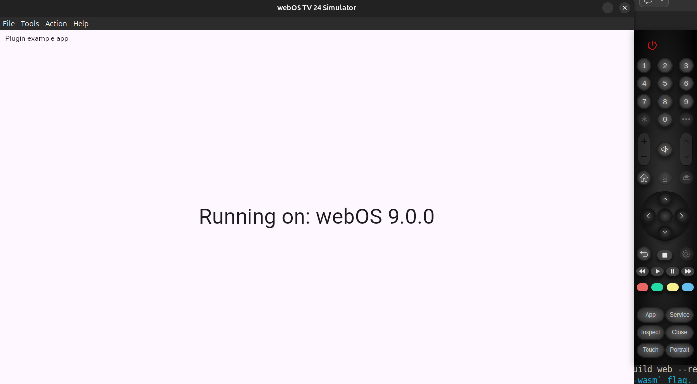

# device_info_plus_webos

Device info plus plugin implementation for webOS

## Setup

1. Ensure your Flutter app supports webOS devices and simulators (Check [examples](example/webos))

2. Include [webOSTV.js](https://webostv.developer.lge.com/develop/references/webostvjs-introduction) library in your app's index.html:

```html
<script src="webOSTVjs-1.2.13/webOSTV.js"></script>
<script src="flutter_bootstrap.js" async></script>
```

3. Complie your app as a web app, move compled contents of `build/web` folder `webos` folder and install it on your webOS device or simulator


